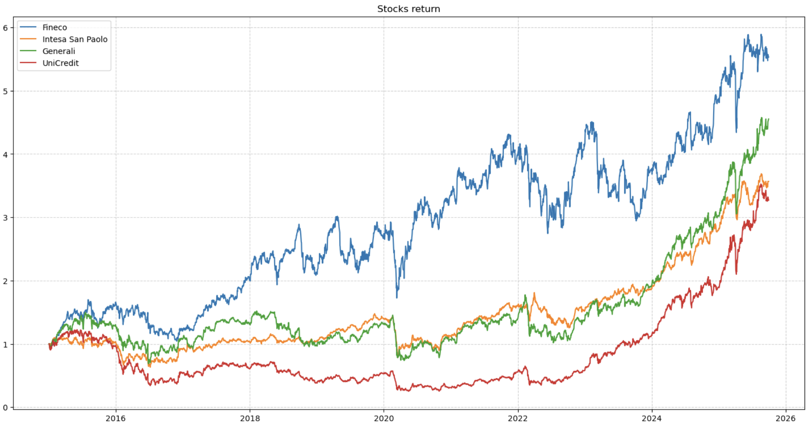
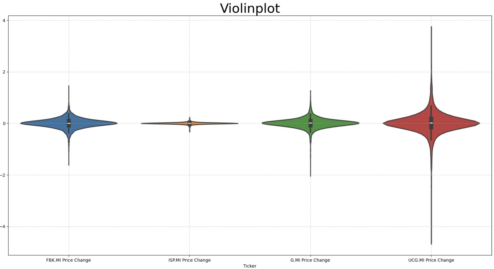
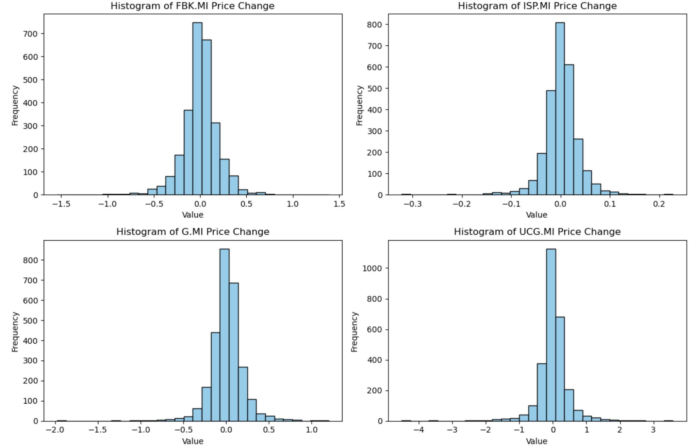
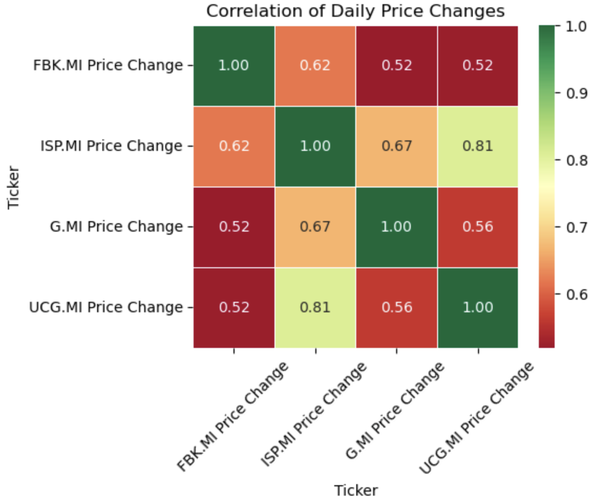

# Italian-Financial-Stocks-Analysis
## Description 
This project analyzes the performance of a portfolio of four major stocks listed on the Italian Stock Exchange: Fineco, Intesa San Paolo, Generali, and UniCredit, starting from January 1, 2015.

## 📊Visualizations Produced
The code generates the following visual analyses:

1. Normalized Returns Chart: Compares the performance of the stocks over time, starting from the same initial value.

2. Violin Plot: Shows the distribution and density of daily price changes for each stock, allowing for an assessment of their volatility.

3. Histograms: Details the frequency of price changes for each stock.

4. Correlation Heatmap: Highlights the linear relationships between the returns of the different stocks.

## Libraries 
- yfinance
- pandas
- matplotlib.pyplot
- datetime
- seaborn

## Charts you will visualise

## Author
Raoul Alessandro Baciu
Master's student in Economics and Finance at Ca' Foscari
[Linkedin](www.linkedin.com/in/raoul-alessandro-baciu-12004b236)
